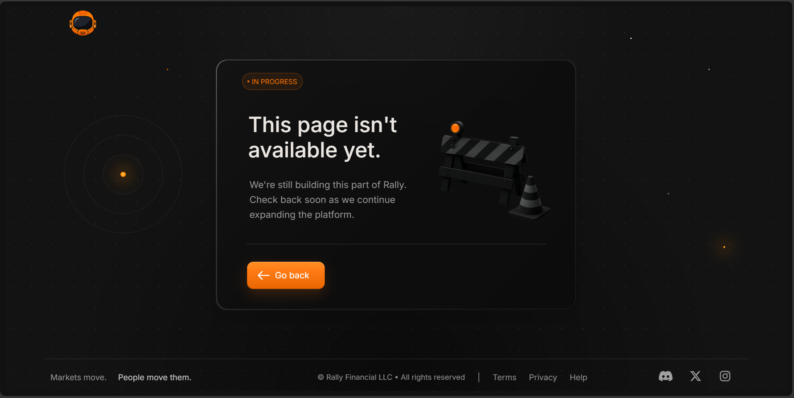

# rally 📈
Modern Live Market Platform

**A live market platform — bridging beautiful data visualization with modern social features.**

> 🚧 **Actively in development — core loop is live, with more on the way.**

---

## Why Rally?

Markets have been overdeveloped when it comes to showing data *many different ways* — but
rarely in a way that's genuinely **beautiful**, and rarely keeping pace with **modern
social components**.

The gap is real: even Robinhood — a billion-dollar company — only launched the *beta* of
its social feature in 2026, and even then it isn't without its rough edges. The appetite
for social, community-driven market tools is clearly there; it just hasn't been fully
realized yet. Rally was built to bridge those two worlds — beautiful data and modern
social — into a single platform.

The name comes from the data itself: **"Rally" is the single most-used word in the entire
market.** It felt fitting for a platform built to bring the market to life.

---

## 📸 Screenshots

| Landing Page | Stock Page Bullish | Stock Page Bearish | Unavailable Page |
|--------------|-----------------|-------------|------------------|
|  |   |  |  |

---

## 🎨 Design Decisions

Rally was designed intentionally — every visual and layout choice serves how a user reads
and experiences the market.

**A dark UI with orange gradients — "dark energy" aesthetic.**
The interface is built on a dark foundation with a gradient orange as the theme color.
The goal was a focused, energetic aesthetic: the dark base keeps attention on the data and
stays easy on the eyes, while the warm orange gradients bring life and draw the eye to
what matters.

**A stock page that feels live — like a social stream, not a spreadsheet.**
The initial page load (the stock page — `index.html`) was designed to feel like an
almost social, live-stream-level data encounter — putting the primary, most important
information front and center the instant a user lands. From there, scrolling progressively
reveals supporting artifacts — market data, related stocks, news, and more — layered by
importance rather than dumped all at once. Primary information leads; supporting detail
follows.

---

## ✨ Features

- 🔍 **Stock search** — look up any ticker and watch the page fill out with live data
- 📊 **Live market data** — powered by Massive.com (Polygon.io)
- 💬 **Live chat** — modern social functionality built into the platform
- 🎯 **Layered information hierarchy** — primary data up top, supporting detail on scroll

---

## 🔄 Core Loop

Search a stock → the page comes to life, populating with real market data pulled from
Massive.com (Polygon.io) → scroll to explore supporting data, related stocks, and news →
engage through live chat.

---

## 🛠️ Tech Stack

- **Front End:** Vanilla JavaScript, HTML5, CSS3 (no frameworks — built from scratch)
- **Back End:** Java, Spring Boot
- **Market Data:** Massive.com (Polygon.io)

---

## 🚀 Running Locally

1. Clone the repo
2. Add your Massive.com (Polygon.io) API key to your application config
3. Start the Spring Boot backend
4. Open the front end in your browser

---

*Built by Ian Trachl — [github.com/MrTrachl](https://github.com/MrTrachl)*
